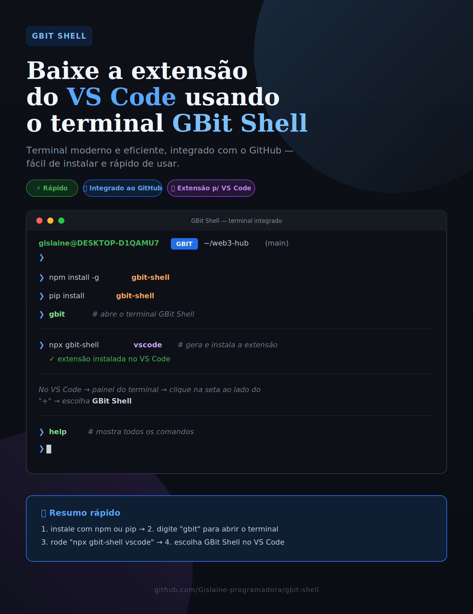
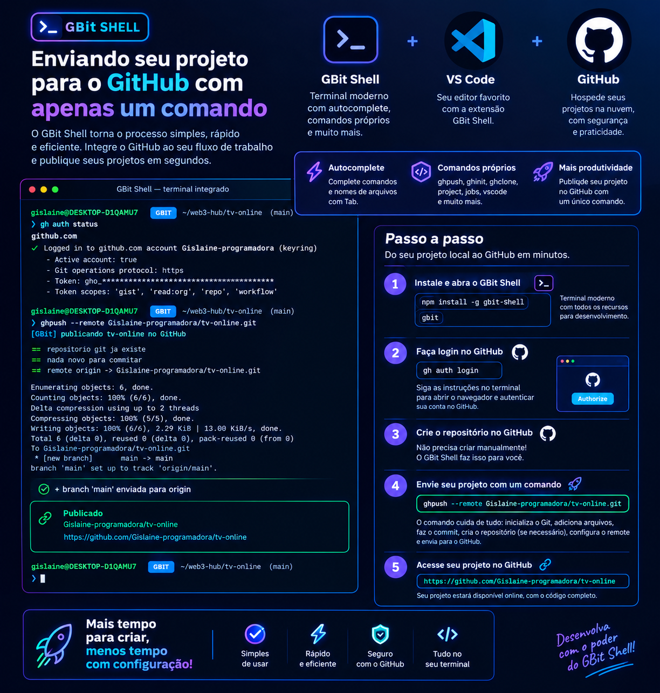

<p align="center">
  
</p>

<h1 align="center"> GBit Shell para VS Code

Adiciona o GBit Shell a lista de terminais integrados do VS Code.</h1>

<p align="center"> 
  Terminal interativo moderno para desenvolvimento — prompt inteligente, integração com Git,<br>
  comandos de produtividade, e perfil próprio para o terminal integrado do VS Code.
</p>

<p align="center">
  
  
  
  
  
</p>

---

## O que é

GBit Shell é uma segunda opção de terminal para quem já usa Git Bash, PowerShell ou Zsh. Ele roda sobre o shell do sistema, então seus comandos habituais continuam funcionando exatamente como antes — só que agora com prompt informativo, autocompletar de verdade, e comandos como `ghpush`, `ports` e `killport` que eliminam tarefas repetitivas.

É um shell interativo escrito em Python, que roda igual no Windows, macOS e Linux, e também se instala como perfil de terminal integrado no VS Code, junto com PowerShell, cmd e Git Bash.

O prompt fica assim:

```
gislaine@DESKTOP-D1QAMU7   GBIT   ~/web3-hub   (main)
❯
```


<p align="center">  </p>


<div align="center">

  
Cada trecho tem um propósito: usuário e máquina, o selo do projeto, o caminho encurtado, o estado do git (arquivos no stage, modificados, novos), o ambiente virtual do Python ativo, e a detecção de projeto Node.

---

## Usar dentro do VS Code
 
## Instalação

**Via npx** — não instala nada permanentemente

```bash
npx gbit-shell
```

**Via npm** — instalação global

```bash
npm install -g gbit-shell
```

**Via pip** — direto do PyPI

```bash
pip install gbit-shell
```

Na primeira execução via `npx` ou `npm`, as dependências Python são instaladas automaticamente. Pra atualizar depois:

```bash
python -m pip install --upgrade gbit-shell
```

### Abrir o terminal

Depois de instalado, por qualquer um dos três caminhos, rode:


```bash
gbit
```

## Vai abrir o terminal, o gbitshell para instalar a  extensao dentro do terminal roda agora:

```bash
vscode

---

Adiciona o GBit Shell à lista de terminais integrados do VS Code, junto com PowerShell, cmd e Git Bash. 

### Instalar a extensão (recomendado)


> ⚠️ O comando é `vscode`, digitado dentro do GBIT shell (`gbit` → `vscode`)`, 

Isso gera o `.vsix` automaticamente (usando só Python, sem precisar de Node) e já instala no VS Code. Se o pacote não estiver instalado globalmente ainda, 

```bash
npx gbit-shell vscode
```

Se quiser só gerar o `.vsix` sem instalar:

```bash
vscode --build
```

O arquivo é salvo em `~/.gbit-shell/`. Pra instalar manualmente depois:

```bash
code --install-extension ~/.gbit-shell/gislaine.gbit-shell-terminal-1.0.0.vsix
```

Depois de instalar, recarregue a janela (`Ctrl+Shift+P` → **Developer: Reload Window**). No painel do terminal:

1. Clique na seta ao lado do `+`
2. Escolha **GBit Shell**

Pra torná-lo o terminal padrão: `Ctrl+Shift+P` → **GBit Shell: Definir como terminal padrão**.

### Configuração manual (sem a extensão)

Se preferir não instalar a extensão, adicione isto ao `settings.json` do VS Code:

```json
{
  "terminal.integrated.profiles.windows": {
    "GBit Shell": {
      "path": "py",
      "args": ["-3", "-m", "gbit_shell"],
      "icon": "terminal"
    }
  },
  "terminal.integrated.profiles.linux": {
    "GBit Shell": {
      "path": "python3",
      "args": ["-m", "gbit_shell"],
      "icon": "terminal"
    }
  },
  "terminal.integrated.defaultProfile.windows": "GBit Shell"
}
```

### Comandos da extensão

| Comando na paleta | O que faz |
|---|---|
| GBit Shell: Novo terminal | abre um terminal GBit |
| GBit Shell: Novo terminal ao lado | abre dividindo o painel atual |
| GBit Shell: Publicar no GitHub | pede a mensagem do commit e roda `ghpush` |
| GBit Shell: Adicionar perfil ao settings.json | grava o perfil sem mexer no padrão |
| GBit Shell: Definir como terminal padrão | grava o perfil e o torna padrão |
| GBit Shell: Verificar instalação | mostra qual Python e quais dependências foram encontrados |

> Definir como padrão precisa gravar um perfil de verdade no `settings.json` — o VS Code não aceita como padrão um perfil que existe só dentro da extensão. Os dois comandos acima fazem isso por você.

Nas configurações (`gbitShell.*`) dá pra escolher o Python, o tema, o texto do selo, e ligar/desligar o selo `node` ou o estado do git. O perfil gravado inclui `overrideName`, então a aba do terminal mostra "GBit Shell" em vez do nome do processo (`python`). A extensão também coloca um botão GBit na barra de status e um ícone de publicar no painel de controle de versão.

## Visualize seu projeto Node.js ou HTML localmente com um único comando: serve.

## Examplo:

gislaine@DESKTOP-D1QAMU7 GBIT ~/web3-hub (main)
❯ cd ecossistema-page

gislaine@DESKTOP-D1QAMU7 GBIT ~/web3-hub/ecossistema-page (main)
❯ serve
[GBit] servindo . em http://localhost:8000
(Ctrl+C para parar )

Aviso: servidor sem autenticação — use apenas em rede local.
Serving HTTP on :: port 8000
(http://[::]:8000/ )

Depois, abra no navegador:

http://localhost:8000

---

## Comandos

### GitHub

<p align="center">
  
</p>

### Requisitos

Python 3.9 ou superior. Nada mais é obrigatório — o `git` só é necessário para os comandos de git, e o [gh CLI](https://cli.github.com) apenas se você quiser que o `ghpush` crie repositórios novos automaticamente.

```bash
winget install --id GitHub.cli
```
> Roda esse comando de dentro do próprio GBit Shell.

---

## 🚀 Como Enviar Projetos com 1 Comando para o github:

O **Gbit Shell** integra automações inteligentes para você gerenciar seus repositórios no GitHub sem burocracia direto pelo terminal customizado **GBIT**.

### Passo a Passo:

1. **Faça login no GitHub (apenas na primeira vez):**
  
   
   ```bash
   gh auth login
   
2. ## Depois cria seu repositorio no github

3. ## Com apenas esse comando ja gera a url e pronto, esta publicado: 

```bash
ghpush --remote https://github.com/seu-usuario/tv-online.git
```


Um comando faz tudo o que normalmente são vários passos decorados: cria o repositório git se não existir, gera um `.gitignore` sensato, adiciona os arquivos, cria o commit, cria o repositório no GitHub e envia.

```bash
ghpush                                                # publica com mensagem padrão
ghpush -m "feat: nova página"                         # com mensagem própria
ghpush -n meu-site -p                                 # nome customizado, repositório privado
ghpush --remote https://github.com/usuario/repo.git   # usa um repositório existente
```


| Comando | Descrição |
|---|---|
| `ghpush` | init + gitignore + commit + cria repo + push |
| `ghpush -m "msg"` | o mesmo, com mensagem de commit |
| `ghpush -p` | repositório privado |
| `ghpush --remote <url>` | usa um remote existente em vez de criar |
| `ghinit [nome]` | cria o repositório no GitHub sem enviar |
| `ghclone usuario/repo` | clona um repositório |
| `ghstatus` | branch, remote, arquivos alterados, autenticação |
| `ghopen` | abre o repositório no navegador |

### Desenvolvimento

| Comando | Descrição |
|---|---|
| `serve [porta]` | servidor HTTP estático na pasta atual (padrão 8000) |
| `ports` | lista portas TCP em escuta, com PID e processo |
| `killport <porta>` | encerra o processo que ocupa a porta |
| `sysinfo` | sistema, CPU, memória e ferramentas instaladas |

O `killport` resolve o erro mais irritante do desenvolvimento web: `EADDRINUSE: port 3000 already in use`.

### Navegação e arquivos

| Comando | Descrição |
|---|---|
| `cd <dir>` | muda de diretório; `cd -` volta ao anterior |
| `ls` / `ls -la` | lista com cores, pastas primeiro |
| `pwd` | diretório atual |
| `cat <arquivo>` | exibe o conteúdo |
| `mkdir` / `touch` / `rm` / `cp` / `mv` | operações de arquivo |
| `which <cmd>` | descobre se é builtin, alias ou programa |

Esses comandos são implementados em Python, então funcionam igual no Windows, sem precisar de coreutils ou Git Bash.

### Shell

| Comando | Descrição |
|---|---|
| `alias` | lista os atalhos definidos |
| `alias nome=comando` | cria um atalho |
| `export CHAVE=valor` | define variável de ambiente |
| `env [filtro]` | lista variáveis, ocultando tokens e senhas |
| `history [n]` | histórico de comandos |
| `theme [nome]` | troca o tema: `gbit`, `ocean` ou `mono` |
| `set` | lista as opções do prompt e seus valores |
| `set opcao=valor` | muda na hora; com `--save` grava no `~/.gbitrc` |
| `reload` | recarrega o `~/.gbitrc` sem reiniciar |
| `help [topico]` | ajuda geral ou de `config`, `github`, `jobs`, `project`, `keys` |
| `exit` | sai |

Qualquer comando que não seja builtin é repassado ao sistema. `git`, `npm`, `node`, `python`, `docker` funcionam normalmente, assim como pipes, redirecionamentos e `&&`.

### Controle de jobs

| Comando | Descrição |
|---|---|
| `comando &` | roda em segundo plano e devolve o prompt na hora |
| `jobs` | lista os jobs com número, PID, estado e a linha original |
| `jobs -l` | mesma lista, com o grupo de processos |
| `fg [%n]` | traz o job de volta para o primeiro plano |
| `bg [%n]` | continua um job parado, em segundo plano |
| `kill %n` | encerra o job (aceita `-9`, `-TERM`, `-STOP`, `-CONT`) |
| `wait [%n]` | espera um job, ou todos, terminarem |
| `disown [%n]` | tira o job da lista, sem matar o processo (aceita `-a`) |

Sem argumento, `fg`, `bg` e `kill` agem sobre o job atual, marcado com `+` na listagem. O anterior aparece com `-`. Além de `%1`, também valem `%+`, `%-` e o PID direto.

<details>
<summary><b>Ver exemplo completo de controle de jobs</b></summary>

Em sistemas POSIX (Linux, macOS, WSL) o GBit Shell tem controle de jobs completo, do mesmo jeito que o bash:

```
gbit ~/api (main) ❯ npm run dev
^Z
[1]+  Stopped                 npm run dev

gbit ~/api (main) ❯ jobs
[1]+  Stopped     npm run dev

gbit ~/api (main) ❯ bg
[1]+ npm run dev &

gbit ~/api (main) ❯ python worker.py &
[2] 48213

gbit ~/api (main) ❯ jobs
[1]-  Running     npm run dev
[2]+  Running     python worker.py

gbit ~/api (main) ❯ fg %1
npm run dev
```

`Ctrl+Z` para o processo do primeiro plano e devolve o terminal ao shell. `Ctrl+C` continua atingindo só o filho. Quando um job termina em segundo plano, a mudança de estado é avisada antes do próximo prompt, sem interromper o que você está digitando.

Ao tentar sair com jobs ativos, o shell avisa e pede confirmação — um segundo `exit` fecha e encerra os processos restantes.

No Windows, `comando &` roda em segundo plano e `jobs`, `kill` e `wait` funcionam; o que não existe lá é `Ctrl+Z`, `fg` e `bg`, porque o sistema não tem grupos de processos nem sinal de parada. O shell avisa isso claramente em vez de falhar em silêncio.

</details>

---

## Configuração por projeto: `gbit.json`

Além do `~/.gbitrc`, que vale pra você em qualquer lugar, cada projeto pode ter o seu próprio `gbit.json` na raiz. Ele é carregado automaticamente ao abrir o shell dentro do projeto, e recarregado quando você entra nele com `cd`.

```json
{
  "name": "minha-api",
  "tag": "API",
  "theme": "ocean",
  "env": {
    "NODE_ENV": "development",
    "PORT": "3000"
  },
  "aliases": {
    "up": "docker compose up -d",
    "logs": "docker compose logs -f"
  },
  "scripts": {
    "dev": "npm run dev",
    "test": "pytest -q",
    "deploy": "npm run build && ghpush -m 'deploy'"
  },
  "onEnter": "git fetch --quiet"
}
```

| Chave | Para que serve |
|---|---|
| `name` | nome exibido nas informações do projeto |
| `tag` | selo do prompt enquanto você está no projeto |
| `theme` | tema aplicado dentro do projeto |
| `env` | variáveis carregadas no ambiente |
| `aliases` | atalhos que existem só neste projeto |
| `scripts` | tarefas chamadas com `run <nome>` |
| `onEnter` | comando rodado ao entrar no projeto |

| Comando | Descrição |
|---|---|
| `project` | mostra o projeto detectado, o arquivo, os scripts e os aliases |
| `project init` | cria um `gbit.json` inicial, adivinhando o tipo do projeto |
| `project reload` | recarrega o arquivo depois de editar |
| `run` | lista os scripts disponíveis |
| `run <nome>` | executa o script; argumentos extras são repassados |

O `project init` olha o diretório antes de escrever: em um projeto Node ele já preenche os scripts a partir do `package.json`; em Python, sugere `pytest`; se encontrar um `Dockerfile` ou `docker-compose.yml`, inclui os atalhos de container. A tag do prompt sempre nasce como `GBIT` — personalize depois se quiser um selo próprio por projeto.

Aliases do projeto têm prioridade sobre os do `~/.gbitrc`, e o Tab completa os nomes de `run`. As variáveis de `env` valem apenas na sessão, nunca escrevem nada no sistema.

---

## Atalhos de teclado

| Atalho | Ação |
|---|---|
| `Tab` | completa comando, caminho, subcomando do git, branch, script do npm |
| `↑` `↓` | navega no histórico |
| `→` | aceita a sugestão em cinza |
| `Ctrl+R` | busca reversa no histórico |
| `Ctrl+A` / `Ctrl+E` | início / fim da linha |
| `Ctrl+W` | apaga a palavra anterior |
| `Ctrl+U` | apaga a linha |
| `Ctrl+L` | limpa a tela |
| `Ctrl+C` | cancela o comando, sem fechar o shell |
| `Ctrl+Z` | para o comando atual e devolve o prompt (POSIX) |
| `Ctrl+D` | sai |

O autocompletar é sensível ao contexto: `git ch` + Tab sugere `checkout`; `git checkout ` + Tab lista as branches reais do repositório; num projeto Node, `npm run ` + Tab lista os scripts do `package.json`.

---

## Configuração

O arquivo `~/.gbitrc` é criado na primeira execução.

```bash
# Prompt
set theme=ocean
set tag=WEB3
set show_git=true
set show_venv=true
set show_time=false
set prompt_style=full     # full ou minimal

# Atalhos
alias ll=ls -la
alias gs=git status
alias dev=npm run dev
alias pub=ghpush

# Ambiente
export EDITOR=code

# Executado ao abrir o shell
run sysinfo
```

Depois de editar manualmente, rode `reload` pra aplicar sem reiniciar.

### Temas

| Tema | Aparência |
|---|---|
| `gbit` | ciano e violeta — o padrão |
| `ocean` | tons de azul |
| `mono` | sem cores, pra terminais limitados |

### Ajustando o prompt na hora

O selo `node` vem desligado de fábrica, pro prompt ficar limpo. O comando `set` mostra e muda as opções sem reiniciar:

```bash
set                        # lista tudo com os valores atuais
set show_node=true         # mostra o selo "node" em projetos com package.json
set show_git=false         # esconde o estado do git
set prompt_style=minimal   # prompt curto, só o caminho
set tag=WEB3 --save        # muda o selo e grava no ~/.gbitrc
```

Sem `--save` a mudança vale só pra sessão atual — ótimo pra experimentar. Com `--save`, a linha é escrita (ou substituída) no `~/.gbitrc`.

> **Selo preso num valor antigo?** Se o prompt mostrar um selo que você não configurou, é porque ele foi gravado no `~/.gbitrc` em algum momento com `--save`. Edite o arquivo, ajuste a linha `set tag=...` (ou apague-a pra voltar ao padrão `GBIT`), e rode `reload`.

---

## Uso não interativo

```bash
gbit -c "ghpush -m 'deploy'"    # roda um comando e sai
gbit --no-banner                # abre sem o logo
gbit --version
```

Útil em scripts e em pipelines de CI.

---

## Estrutura do projeto

```
gbit-shell/
├── bin/
│   ├── gbit                    launcher POSIX
│   ├── gbit.cmd                launcher Windows CMD
│   └── gbit.js                 launcher Node, usado pelo npm/npx
├── gbit_shell/
│   ├── __main__.py             ponto de entrada, parsing de argumentos
│   ├── shell.py                sessão interativa, loop principal
│   ├── executor.py             execução: builtins, pipes, jobs, passthrough
│   ├── builtins.py             os comandos internos
│   ├── jobs.py                 gerenciador de jobs, sinais e terminal
│   ├── jobcmds.py              jobs, fg, bg, kill, wait, disown
│   ├── project.py              leitura do gbit.json e detecção de projeto
│   ├── completer.py            autocompletar sensível ao contexto
│   ├── prompt.py               montagem do prompt
│   ├── styles.py               temas de cor
│   ├── gitinfo.py              leitura rápida do estado do git, com cache
│   └── config.py               leitura do ~/.gbitrc
├── vscode-extension/
│   ├── extension.js            integração com o VS Code
│   └── package.json            manifesto da extensão
├── tools/
│   └── build_vsix.py           empacota a extensão sem depender do Node
├── assets/
│   └── banner-gbit-shell.png   banner do projeto
├── tests/
│   ├── test_shell.py           núcleo do shell
│   └── test_jobs_project.py    jobs e configuração de projeto
├── gbit.json                   configuração do próprio projeto
├── pyproject.toml
├── package.json
└── README.md
```

---

## Como funciona por dentro

O shell lê uma linha, expande aliases (do projeto primeiro, depois os globais), e divide a linha em `&&`, `||` e `;` no próprio Python. Cada parte segue um de três caminhos:

1. Se tem pipe, redirecionamento ou glob, delega ao shell do sistema, que já sabe fazer isso bem.
2. Se o primeiro token é um builtin, executa a função Python correspondente.
3. Caso contrário, cria o processo diretamente com `subprocess`, sem camada de shell.

Essa divisão é o que mantém o shell rápido e ao mesmo tempo compatível — é o que faz `cd api && npm install` funcionar de verdade, mudando o diretório do próprio shell.

O controle de jobs segue o modelo POSIX: cada comando nasce em um grupo de processos próprio (`setpgrp`), o shell entrega o terminal a esse grupo com `tcsetpgrp` e o retoma depois. Os filhos recebem os sinais de parada restaurados ao comportamento padrão, então `Ctrl+Z` chega em quem deve. Jobs terminados são recolhidos sem bloquear, e o aviso aparece antes do próximo prompt.

O estado do git no prompt vem de chamadas com timeout curto e cache de 1,5 segundo por diretório, então o prompt não trava mesmo em repositórios grandes.

---

## Testes

```bash
pip install pytest
python -m pytest tests/ -v
```

Cobrem parsing de configuração, expansão de aliases, encurtamento de caminho, detecção de metacaracteres, divisão de sequências com `&&`, ciclo de vida de jobs, leitura e escrita do `gbit.json`, detecção de tipo de projeto, temas, autocompletar, leitura do git, e o CLI de ponta a ponta.

---

## Segurança

O comando `env` oculta valores de variáveis cujo nome contém `TOKEN`, `SECRET`, `PASSWORD`, `KEY` ou `PASS`. O módulo de GitHub nunca imprime nem armazena credenciais — a autenticação fica inteiramente a cargo do `gh` CLI e do `git`.

O comando `serve` sobe um servidor HTTP sem autenticação e avisa isso ao iniciar. Use apenas em rede local.

---

## Licença

MIT

## Autor

Gislaine Lopes · gbit-ecossistema, open source
📧 gislainelopes@gmail.com

