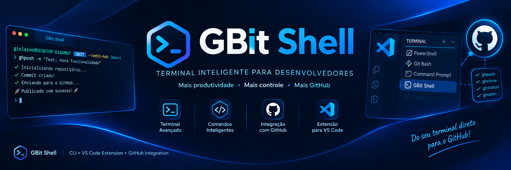

# GBit Shell para VS Code

Adiciona o GBit Shell a lista de terminais integrados do VS Code.

## O que ela faz

Depois de instalada, o GBit Shell aparece no menu do terminal ao lado de PowerShell, cmd e Git Bash. A extensao encontra o Python sozinha, avisa se algo esta faltando, e oferece atalhos para publicar o projeto no GitHub sem sair do editor.

## Instalacao


<p align="center">  </p>


<div align="center">

# 🔧 GBIT-SHELL CLI

#  GBIT SHELL
---


# GBit Shell

Terminal moderno para desenvolvimento, com publicacao no GitHub em um comando.

   

---

# GBit Shell para VS Code

Adiciona o GBit Shell a lista de terminais integrados do VS Code.

---


## O que é

GBit Shell é uma segunda opção de terminal para quem já usa Git Bash, PowerShell ou Zsh. Ele roda sobre o shell do sistema, então seus comandos habituais continuam funcionando, mas o prompt ganha informação útil, o Tab completa de verdade e comandos como `ghpush`, `ports` e `killport` eliminam tarefas repetitivas.


O GBit Shell e um shell interativo escrito em Python que roda no Windows, macOS e Linux. , adicionando prompt inteligente, autocompletar de verdade, e comandos prontos para as tarefas que todo desenvolvedor repete todo dia.


GBit Shell e uma extensao que adiciona como perfil de terminal integrado no VS Code, junto com PowerShell, cmd e Git Bash.

O prompt fica assim:

```
gislaine@DESKTOP-D1QAMU7  GBIT  ~/web3-hub  (main)
❯
```


---

## Instalacao

### Via npx (nao instala nada permanentemente)

```bash
npx gbit-shell
```

Na primeira execucao ele instala as dependencias Python automaticamente.

### Via npm (global)

```bash
npm install -g gbit-shell
python -m pip install --upgrade gbit-shell
```

### Via pip

```bash
pip install gbit-shell
gbit
```

## Para abrir o terminal gbit-shell:

```bash
gbit
```

### instalar extensao dentro do comando gbit:


Depois de instalar o GBit Shell via npm ou pip, rode:

> **Atencao:** o comando e `vscode` digitado **dentro do terminal GBit Shell**,

```bash
vscode
```

---
Se o pacote npm nao estiver instalado globalmente, use o launcher temporario:

```bash
npx gbit-shell vscode
```

`npx vscode` nao chama o GBit Shell; ele procura outro pacote npm chamado
`vscode`. O nome correto do pacote e `gbit-shell`.

Esse comando gera o `.vsix` automaticamente (usando apenas Python, sem Node) e instala no VS Code. Pronto!


Depois disso, no VS Code:

1. Abra o painel do terminal
2. Clique na seta ao lado do `+` >
3. Escolha GBit Shell

Para torna-lo o terminal padrao, use a paleta de comandos (`Ctrl+Shift+P`) e rode GBit Shell: Definir como terminal padrao.

Existe uma extensao pronta na pasta `vscode-extension/`. Depois de instalada, o GBit Shell aparece na lista de terminais do VS Code, junto com PowerShell, cmd e Git Bash.
ao clicar + > escolhe o terminal gbit shell


## Usar dentro do VS Code ao instalar

Se quiser so gerar o `.vsix` sem instalar:

```
vscode --build
```

O `.vsix` e salvo em `~/.gbit-shell/`. Para instalar manualmente depois:

```bash
code --install-extension ~/.gbit-shell/gislaine.gbit-shell-terminal-1.0.0.vsix
```


O pacote ja vem pronto na pasta `dist/`, entao basta uma linha:


GBit Shell e uma extensao que adiciona como perfil de terminal integrado no VS Code, junto com PowerShell, cmd e Git Bash.


Depois de instalar, recarregue a janela (`Ctrl+Shift+P` → Developer: Reload Window).
se quiser gerar o pacote de novo depois de mexer na extensao:


```bash
python tools/build_vsix.py dist
```


### Configuracao manual (sem a extensao)

Se preferir nao instalar a extensao, adicione isto ao `settings.json` do VS Code:

```json
{
  "terminal.integrated.profiles.windows": {
    "GBit Shell": {
      "path": "py",
      "args": ["-3", "-m", "gbit_shell"],
      "icon": "terminal"
    }
  },
  "terminal.integrated.profiles.linux": {
    "GBit Shell": {
      "path": "python3",
      "args": ["-m", "gbit_shell"],
      "icon": "terminal"
    }
  },
  "terminal.integrated.defaultProfile.windows": "GBit Shell"
}
```

### Comandos da extensao

| Comando na paleta | O que faz |
|---|---|
| GBit Shell: Novo terminal | abre um terminal GBit |
| GBit Shell: Novo terminal ao lado | abre dividindo o painel atual |
| GBit Shell: Publicar no GitHub | pede a mensagem do commit e roda `ghpush` |
| GBit Shell: Adicionar perfil ao settings.json | grava o perfil sem mexer no padrao |
| GBit Shell: Definir como terminal padrao | grava o perfil e o torna padrao |
| GBit Shell: Verificar instalacao | mostra qual Python e quais dependencias foram encontrados |

Definir como padrao precisa gravar um perfil de verdade no `settings.json`: o VS Code nao aceita como padrao um perfil que existe apenas dentro da extensao. Os dois comandos acima fazem isso por voce.

Nas configuracoes (`gbitShell.*`) da para escolher o Python, o tema, o texto do selo, e ligar o selo `node` ou desligar o estado do git no prompt.

O perfil gravado no `settings.json` inclui `overrideName`, para a aba do terminal mostrar GBit Shell em vez do nome do processo (`python`).

A extensao tambem coloca um botao GBit na barra de status e um icone de publicar no painel de controle de versao.

---

## Comandos


### Requisitos

Python 3.9 ou superior. Nada mais e obrigatorio. O `git` e necessario apenas para os comandos de git, e o [gh CLI](https://cli.github.com) apenas se voce quiser que o `ghpush` crie repositorios novos automaticamente.


. Instalar o GitHub CLI

No próprio GBit Shell, execute:

```bash
winget install --id GitHub.cli
```

## O comando para integrar seu projeto com github

```bash
ghpush
```

Um comando faz tudo: cria o repositorio git se nao existir, gera um `.gitignore` sensato, adiciona os arquivos, faz o commit, cria o repositorio no GitHub e envia. O que normalmente sao os  comandos decorados.

```bash
ghpush                              # publica com mensagem padrao
ghpush -m "feat: nova pagina"       # com mensagem propria
ghpush -n meu-site -p               # nome customizado, repositorio privado
ghpush --remote https://github.com/usuario/repo.git   # usa um repo existente
ghpush [-m msg]         init + commit + cria repo + push, tudo de uma vez  
ghpush -p               o mesmo, mas repositorio privado                   
ghpush --remote <url>   usa um remote existente em vez de criar            
ghinit                  cria o repo no GitHub sem enviar                   
ghclone user/repo       clona um repositorio                               
ghstatus                estado do repo, remote e autenticacao              
ghopen                  abre o repositorio no navegador   
```

### GitHub

| Comando | Descricao |
|---|---|
| `ghpush` | init + gitignore + commit + cria repo + push |
| `ghpush -m "msg"` | o mesmo, com mensagem de commit |
| `ghpush -p` | repositorio privado |
| `ghpush --remote <url>` | usa um remote existente em vez de criar |
| `ghinit [nome]` | cria o repositorio no GitHub sem enviar |
| `ghclone usuario/repo` | clona um repositorio |
| `ghstatus` | branch, remote, arquivos alterados, autenticacao |
| `ghopen` | abre o repositorio no navegador |

### Desenvolvimento

| Comando | Descricao |
|---|---|
| `serve [porta]` | servidor HTTP estatico na pasta atual (padrao 8000) |
| `ports` | lista portas TCP em escuta, com PID e processo |
| `killport <porta>` | encerra o processo que ocupa a porta |
| `sysinfo` | sistema, CPU, memoria e ferramentas instaladas |

O `killport` resolve o erro mais irritante do desenvolvimento web: `EADDRINUSE: port 3000 already in use`.

### Navegacao e arquivos

| Comando | Descricao |
|---|---|
| `cd <dir>` | muda de diretorio; `cd -` volta ao anterior |
| `ls` / `ls -la` | lista com cores, pastas primeiro |
| `pwd` | diretorio atual |
| `cat <arquivo>` | exibe o conteudo |
| `mkdir` / `touch` / `rm` / `cp` / `mv` | operacoes de arquivo |
| `which <cmd>` | descobre se e builtin, alias ou programa |

Esses comandos sao implementados em Python, entao funcionam igual no Windows, sem precisar de coreutils ou Git Bash.

### Shell

| Comando | Descricao |
|---|---|
| `alias` | lista os atalhos definidos |
| `alias nome=comando` | cria um atalho |
| `export CHAVE=valor` | define variavel de ambiente |
| `env [filtro]` | lista variaveis, ocultando tokens e senhas |
| `history [n]` | historico de comandos |
| `theme [nome]` | troca o tema: gbit, ocean ou mono |
| `set` | lista as opcoes do prompt e seus valores |
| `set opcao=valor` | muda na hora; com `--save` grava no `~/.gbitrc` |
| `reload` | recarrega o `~/.gbitrc` sem reiniciar |
| `help [topico]` | ajuda geral ou de `config`, `github`, `keys` |
| `exit` | sai |

Qualquer comando que nao seja builtin e repassado ao sistema. `git`, `npm`, `node`, `python`, `docker` funcionam normalmente, assim como pipes, redirecionamentos e `&&`.

### Controle de jobs

| Comando | Descricao |
|---|---|
| `comando &` | roda em segundo plano e devolve o prompt na hora |
| `jobs` | lista os jobs com numero, PID, estado e a linha original |
| `jobs -l` | mesma lista, com o grupo de processos |
| `fg [%n]` | traz o job de volta para o primeiro plano |
| `bg [%n]` | continua um job parado, em segundo plano |
| `kill %n` | encerra o job (aceita `-9`, `-TERM`, `-STOP`, `-CONT`) |
| `wait [%n]` | espera um job, ou todos, terminarem |
| `disown [%n]` | tira o job da lista, sem matar o processo (aceita `-a`) |

Sem argumento, `fg`, `bg` e `kill` agem sobre o job atual, marcado com `+` na listagem. O anterior aparece com `-`. Alem de `%1`, tambem valem `%+`, `%-` e o PID direto.

---

## Trabalhando com jobs

Em sistemas POSIX (Linux, macOS, WSL) o GBit Shell tem controle de jobs completo, do mesmo jeito que o bash:

```bash
gbit ~/api (main) $ npm run dev
^Z
[1]+  Stopped                 npm run dev

gbit ~/api (main) $ jobs
[1]+  Stopped     npm run dev

gbit ~/api (main) $ bg
[1]+ npm run dev &

gbit ~/api (main) $ python worker.py &
[2] 48213

gbit ~/api (main) $ jobs
[1]-  Running     npm run dev
[2]+  Running     python worker.py

gbit ~/api (main) $ fg %1
npm run dev
```

`Ctrl+Z` para o processo do primeiro plano e devolve o terminal ao shell. `Ctrl+C` continua atingindo somente o filho. Quando um job termina em segundo plano, a mudanca de estado e avisada antes do proximo prompt, sem interromper o que voce esta digitando.

Ao tentar sair com jobs ativos, o shell avisa e pede confirmacao. Um segundo `exit` fecha e encerra os processos restantes.

No Windows, `comando &` roda em segundo plano e `jobs`, `kill` e `wait` funcionam; o que nao existe la e `Ctrl+Z`, `fg` e `bg`, porque o sistema nao tem grupos de processos nem sinal de parada. O shell diz isso claramente em vez de falhar em silencio.

---

## Configuracao por projeto: gbit.json

Alem do `~/.gbitrc`, que vale para voce em qualquer lugar, cada projeto pode ter o seu proprio `gbit.json` na raiz. Ele e carregado automaticamente ao abrir o shell dentro do projeto, e recarregado quando voce entra nele com `cd`.

```json
{
  "name": "minha-api",
  "tag": "API",
  "theme": "ocean",
  "env": {
    "NODE_ENV": "development",
    "PORT": "3000"
  },
  "aliases": {
    "up": "docker compose up -d",
    "logs": "docker compose logs -f"
  },
  "scripts": {
    "dev": "npm run dev",
    "test": "pytest -q",
    "deploy": "npm run build && ghpush -m 'deploy'"
  },
  "onEnter": "git fetch --quiet"
}
```

| Chave | Para que serve |
|---|---|
| `name` | nome exibido nas informacoes do projeto |
| `tag` | selo do prompt enquanto voce esta no projeto |
| `theme` | tema aplicado dentro do projeto |
| `env` | variaveis carregadas no ambiente |
| `aliases` | atalhos que existem so neste projeto |
| `scripts` | tarefas chamadas com `run <nome>` |
| `onEnter` | comando rodado ao entrar no projeto |

### Comandos

| Comando | Descricao |
|---|---|
| `project` | mostra o projeto detectado, o arquivo, os scripts e os aliases |
| `project init` | cria um `gbit.json` inicial, adivinhando o tipo do projeto |
| `project reload` | recarrega o arquivo depois de editar |
| `run` | lista os scripts disponiveis |
| `run <nome>` | executa o script; argumentos extras sao repassados |

O `project init` olha o diretorio antes de escrever: em um projeto Node ele ja preenche os scripts a partir do `package.json`; em Python, sugere `pytest`; se encontrar um `Dockerfile` ou `docker-compose.yml`, inclui os atalhos de container.

Aliases do projeto tem prioridade sobre os do `~/.gbitrc`, e o Tab completa os nomes de `run`. As variaveis de `env` valem apenas na sessao, nunca escrevem nada no sistema.

---

## Atalhos de teclado

| Atalho | Acao |
|---|---|
| `Tab` | completa comando, caminho, subcomando do git, branch, script do npm |
| `↑` `↓` | navega no historico |
| `→` | aceita a sugestao em cinza |
| `Ctrl+R` | busca reversa no historico |
| `Ctrl+A` / `Ctrl+E` | inicio / fim da linha |
| `Ctrl+W` | apaga a palavra anterior |
| `Ctrl+U` | apaga a linha |
| `Ctrl+L` | limpa a tela |
| `Ctrl+C` | cancela o comando, sem fechar o shell |
| `Ctrl+Z` | para o comando atual e devolve o prompt (POSIX) |
| `Ctrl+D` | sai |

O autocompletar e sensivel ao contexto. Digitar `git ch` e apertar Tab sugere `checkout`. Digitar `git checkout ` e apertar Tab lista as branches reais do repositorio. Em um projeto Node, `npm run ` e Tab lista os scripts do `package.json`.

---

## Configuracao

O arquivo `~/.gbitrc` e criado na primeira execucao.

```bash
# Prompt
set theme=ocean
set tag=WEB3
set show_git=true
set show_venv=true
set show_time=false
set prompt_style=full     # full ou minimal

# Atalhos
alias ll=ls -la
alias gs=git status
alias dev=npm run dev
alias pub=ghpush

# Ambiente
export EDITOR=code

# Executado ao abrir o shell
run sysinfo
```

Depois de editar, rode `reload` para aplicar sem reiniciar.

### Temas

| Tema | Aparencia |
|---|---|
| `gbit` | ciano e violeta, o padrao |
| `ocean` | tons de azul |
| `mono` | sem cores, para terminais limitados |

### Ajustando o prompt na hora

O selo `node` vem desligado de fabrica, para o prompt ficar limpo. O comando `set` mostra e muda as opcoes sem reiniciar:

```bash
set                        # lista tudo com os valores atuais
set show_node=true         # mostra o selo "node" em projetos com package.json
set show_git=false         # esconde o estado do git
set prompt_style=minimal   # prompt curto, so o caminho
set tag=WEB3 --save        # muda o selo e grava no ~/.gbitrc
```

Sem `--save` a mudanca vale so para a sessao atual, o que e otimo para experimentar. Com `--save`, a linha e escrita (ou substituida) no `~/.gbitrc`.

---

## Uso nao interativo

```bash
gbit -c "ghpush -m 'deploy'"    # roda um comando e sai
gbit --no-banner                # abre sem o logo
gbit --version
```

Util em scripts e em pipelines de CI.

---

## Estrutura do projeto

```
gbit-shell/
├── bin/
│   ├── gbit               # launcher POSIX
│   ├── gbit.cmd           # launcher Windows CMD
│   └── gbit.js            # launcher Node, usado pelo npm/npx
├── gbit_shell/
│   ├── __main__.py        # ponto de entrada, parsing de argumentos
│   ├── shell.py           # sessao interativa, loop principal
│   ├── executor.py        # execucao: builtins, pipes, jobs, passthrough
│   ├── builtins.py        # os comandos internos
│   ├── jobs.py            # gerenciador de jobs, sinais e terminal
│   ├── jobcmds.py         # jobs, fg, bg, kill, wait, disown
│   ├── project.py         # leitura do gbit.json e deteccao de projeto
│   ├── completer.py       # autocompletar sensivel ao contexto
│   ├── prompt.py          # montagem do prompt
│   ├── styles.py          # temas de cor
│   ├── gitinfo.py         # leitura rapida do estado do git, com cache
│   └── config.py          # leitura do ~/.gbitrc
├── vscode-extension/
│   ├── extension.js       # integracao com o VS Code
│   └── package.json       # manifesto da extensao
├── tools/
│   └── build_vsix.py      # empacota a extensao sem depender do Node
├── dist/
│   └── *.vsix             # extensao pronta para instalar
├── tests/
│   ├── test_shell.py      # nucleo do shell
│   └── test_jobs_project.py  # jobs e configuracao de projeto
├── gbit.json              # configuracao do proprio projeto
├── pyproject.toml
├── package.json
└── README.md
```

---

## Como funciona por dentro

O shell le uma linha, expande aliases (do projeto primeiro, depois os globais), e divide a linha em `&&`, `||` e `;` no proprio Python. Cada parte segue um de tres caminhos:

1. Se tem pipe, redirecionamento ou glob, delega ao shell do sistema, que ja sabe fazer isso bem.
2. Se o primeiro token e um builtin, executa a funcao Python correspondente.
3. Caso contrario, cria o processo diretamente com `subprocess`, sem camada de shell.

Essa divisao e o que mantem o shell rapido e ao mesmo tempo compativel — e e o que faz `cd api && npm install` funcionar de verdade, mudando o diretorio do proprio shell.

O controle de jobs segue o modelo POSIX: cada comando nasce em um grupo de processos proprio (`setpgrp`), o shell entrega o terminal a esse grupo com `tcsetpgrp` e o retoma depois. Os filhos recebem os sinais de parada restaurados para o comportamento padrao, entao `Ctrl+Z` chega em quem deve. Jobs terminados sao recolhidos sem bloquear, e o aviso aparece antes do proximo prompt.

O estado do git no prompt vem de chamadas com timeout curto e cache de 1,5 segundo por diretorio, entao o prompt nao trava mesmo em repositorios grandes.

---

## Testes

```bash
pip install pytest
python -m pytest tests/ -v
```

Cobrem parsing de configuracao, expansao de aliases, encurtamento de caminho, deteccao de metacaracteres, divisao de sequencias com `&&`, ciclo de vida de jobs, leitura e escrita do `gbit.json`, deteccao de tipo de projeto, temas, autocompletar, leitura do git e o CLI de ponta a ponta.

---

## Seguranca

O comando `env` oculta valores de variaveis cujo nome contem TOKEN, SECRET, PASSWORD, KEY ou PASS. O modulo de GitHub nunca imprime nem armazena credenciais: a autenticacao fica inteiramente a cargo do `gh` CLI e do `git`.

O comando `serve` sobe um servidor HTTP sem autenticacao e avisa isso ao iniciar. Use apenas em rede local.

---

## Licenca

MIT

## Autor 

email-gislainelophes@gmail 
gbit-ecossistema open source

O pacote pronto fica na pasta `dist`. Instale assim (rode o comando dentro da pasta `dist`):

```bash
code --install-extension ~/.gbit-shell/gislaine.gbit-shell-terminal-1.0.0.vsix
```

Se quiser gerar o pacote de novo depois de mexer no codigo:

```bash
python tools/build_vsix.py
```

**Importante:** depois de reinstalar, feche o VS Code por completo (todas as
janelas) e abra de novo. Recarregar a janela nao troca a extensao antiga.

O GBit Shell tambem precisa estar instalado no Python:

```bash
pip install gbit-shell
```

## Como usar

Abra o painel do terminal, clique na seta ao lado do `+`, e escolha GBit Shell.

Para torna-lo o padrao, abra a paleta de comandos com `Ctrl+Shift+P` e rode GBit Shell: Definir como terminal padrao.


## Comandos

| Comando | Descricao |
|---|---|
| GBit Shell: Novo terminal | abre um terminal GBit |
| GBit Shell: Publicar no GitHub | pede a mensagem e roda `ghpush` |
| GBit Shell: Definir como terminal padrao | grava a preferencia |
| GBit Shell: Verificar instalacao | diagnostica Python e dependencias |

## Configuracoes

| Configuracao | Padrao | Descricao |
|---|---|---|
| `gbitShell.pythonPath` | vazio | caminho do Python; vazio detecta automaticamente |
| `gbitShell.theme` | `gbit` | tema de cores: gbit, ocean ou mono |
| `gbitShell.showBanner` | `true` | mostrar o logo ao abrir |
| `gbitShell.promptTag` | `GBIT` | texto do selo no prompt |

## Licenca

MIT
